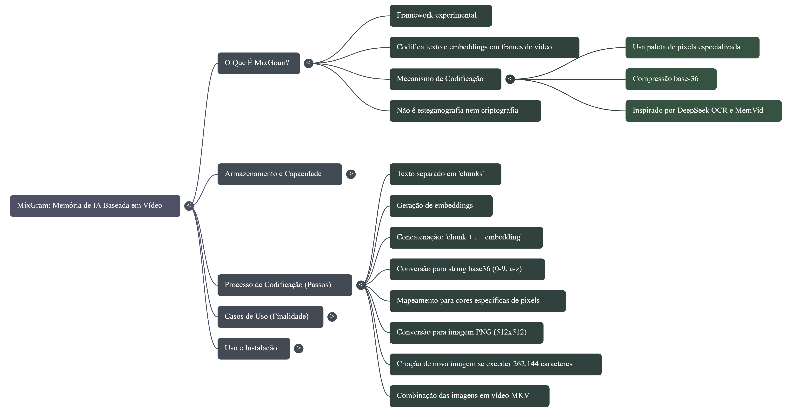

# MixGram (EN) #

A compact pixel-based video encoder for text + embeddings. Store all your data in a single MKV video. Ideal for RAG IA systems.


---

## 🧩 What is MixGram? ##

MixGram is an experimental framework that encodes text and embeddings into video frames using a specialized pixel palette and base-36 compression.

It allows you to store:
- Long texts
- Embedding vectors
- Metadata

inside 512×512 RGB images, which are then exported as a video file .mkv format.


Each image corresponds to a frame of the video; 512 x 512 pixels are equivalent to 262,144 characters. The video has 60 frames per second, which is equivalent to more than 15 million characters in one second of video!



The decoder performs the reverse process, extracting all original content back from the video.


---

## 🎯 What is it used for? ## 

MixGram is useful when you want to:

- Embed structured data inside a video container.
- Store embeddings + text in a visual format.
- Create datasets, containers, or transport layers based on images.
- Experiment with low-bit storage, steganography-like encoding, or visual serialization.
- Generate static or animated assets containing textual/semantic data.


It is not cryptography or steganography.
The content is visible in pixels, only encoded compactly.


---

## 📦 Installation ## 

Install from source (editable mode):

```
git clone https://github.com/lutian/mixgram.git
cd mixgram
pip install -e .
```

---

## 🚀 Using MixGram from the CLI ## 

MixGram includes a command-line tool:

Encode text → video

```
python cli.py encode \
    --input "This is a test for MixGram." \
    --output video.mkv
```

Decode video → text + embeddings

```
python cli.py decode \
    --input video.mkv \
    --output result.json
```

---

## 🐍 Using MixGram in Python ## 

```python
from mixgram.api import encode_video, decode_video

encode_video(
    input_text="Testing MixGram encoder",
    output_path="encoded.mkv"
)

result = decode_video("encoded.mkv")
print(result["texto_reconstruido"])

Output example:

{
  "chunks": ["Testing MixGram encoder"],
  "embeddings": [...],
  "texto_reconstruido": "Testing MixGram encoder"
}
```

See [Example demo_mixgram.py](/examples/demo_mixgram.py) to using an external data and find the best chunk.

----------------------------------------------

# MixGram (🇧🇷) #

Memória para sistemas de IA em vídeo baseado em pixéis para texto + incorporações. Guarde todas as suas informações num único vídeo MKV. Ideal para RAG.


---

## 🧩 O que é MixGram? ##

MixGram é um framework experimental que codifica texto e embeddings dentro de frames de vídeo, usando uma paleta de pixels compacta e compressão base-36.

Com ele é possível armazenar:
- Textos longos
- Vetores de embeddings
- Metadados


dentro de imagens pequenas (512×512 pixels), gerando um vídeo contendo a informação.


ada imagem corresponde a um fotograma do vídeo; 512 x 512 pixéis equivalem a 262.144 caracteres. O vídeo tem 60 fotogramas por segundo, o que equivale a mais de 15 milhões de caracteres num segundo de vídeo!


O decodificador extrai tudo novamente do vídeo.


---

## 🎯 Para que serve? ## 

MixGram é útil quando você deseja:

- Armazenar dados estruturados dentro de vídeos.
- Serializar texto + embeddings em formato visual.
- Criar datasets ou arquivos transportáveis baseados em vídeo.
- Testar técnicas de armazenamento compacto.
- Criar assets visuais que contêm informação sem ser criptografia.


Não é esteganografia nem criptografia;
o conteúdo é visível, apenas codificado.


---

## 📦 Instalação ## 

Via código-fonte (desenvolvimento):

```
git clone https://github.com/lutian/mixgram.git
cd mixgram
pip install -e .
```

---

## 🚀 Usando pelo CLI ## 

Encodar texto → vídeo

```
python cli.py encode \
    --input "Teste do MixGram." \
    --output video.mkv
```

Desencodar vídeo → texto + embeddings

```
python cli.py decode \
    --input video.mkv \
    --output resultado.json
```

---

## 🐍 Usando no Python ## 

```python
from mixgram.api import encode_video, decode_video

encode_video(
    input_text="Testando MixGram",
    output_path="saida.mkv"
)

result = decode_video("saida.mkv")
print(result["texto_reconstruido"])

Output example:

{
  "chunks": ["Testando MixGram"],
  "embeddings": [...],
  "texto_reconstruido": "Testando MixGram"
}
```

Veja [Example demo_mixgram.py](/examples/demo_mixgram.py) para entender como usar com informações num arquivo TXT e encontrar o melhor chunk por acuracidade.

----------------------------------------------


# MixGram (🇪🇸) #

Memoria para sistemas IA en video basado en píxeles para texto + embeddings. Salve todas sus informaciones en un sólo video en formato MKV. Ideal para RAG.


---

## 🧩 ¿Qué es MixGram? ## 

MixGram es un sistema experimental que codifica texto y embeddings dentro de frames de vídeo, usando una paleta especial y compresión base-36.

Permite almacenar:

- Texto extenso
- Vectores de embeddings
- Metadatos


dentro de imágenes 512×512, que luego se exportan como un video.


Cada imagen corresponde a un frame del video, 512 x 512 pixels equivalen a 262144 caracteres, el video tiene 60 frames por segundo lo que equivale a más de 15 millones de caracteres en un segundo de video!


El decodificador recupera todo el contenido original.


---

## 🎯 ¿Para qué sirve? ## 

MixGram es útil para:

- Almacenar datos estructurados dentro de videos.
- Serializar texto + embeddings en formato visual.
- Crear datasets o contenedores gráficos.
- Investigar almacenamiento compacto o formatos alternativos.
- Generar recursos visuales que contengan información.


No es criptografía ni esteganografía:
la información es visible, solo comprimida.


---

## 📦 Instalación ## 

Desde el repositorio:

```
git clone https://github.com/lutian/mixgram.git
cd mixgram
pip install -e .
```

---

## 🚀 Uso desde la CLI ## 

Codificar texto → vídeo
`
```
python cli.py encode \
    --input "Prueba de MixGram." \
    --output video.mkv
```

Decodificar vídeo → texto + embeddings

```
python cli.py decode \
    --input video.mkv \
    --output resultado.json
```

---

## 🐍 Uso desde Python ## 

```python
from mixgram.api import encode_video, decode_video

encode_video(
    input_text="Probando MixGram",
    output_path="salida.mkv"
)

result = decode_video("salida.mkv")
print(result["texto_reconstruido"])

Output example:

{
  "chunks": ["Testeando MixGram"],
  "embeddings": [...],
  "texto_reconstruido": "Testeando MixGram"
}
```

Vea en [Example demo_mixgram.py](/examples/demo_mixgram.py) para entender como usar importando informaciones de un archivo TXT y encontrar el mejor chunk por similaridad.